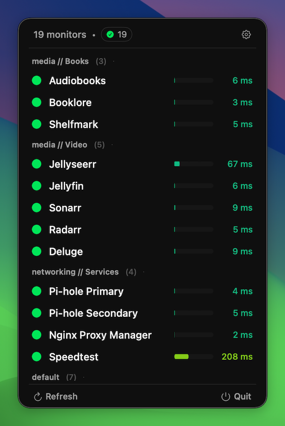
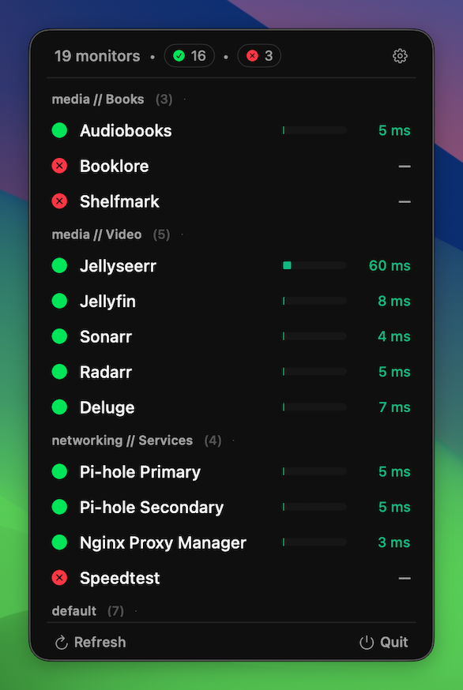

# UptimeBar

A simple macOS menu bar app that shows the current status and response time of your Uptime Kuma monitors at a glance.

## Screenshots

<table>
  <tr>
    <td></td>
    <td></td>
  </tr>
</table>

## Features

- Menu bar summary of monitor status and response time
- Status-aware icon that changes with monitor health
- One-click links to open each monitored service
- Grouping based on Uptime Kuma status pages
- Configurable refresh interval
